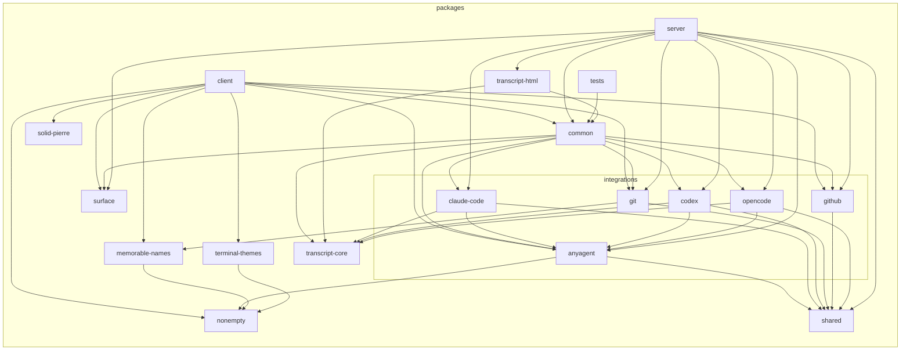

<!-- Generated by `just depcruise-graph`. Do not edit by hand. -->

# Package dependency graph

High-level view of workspace imports — one node per package, collapsed from `.dependency-cruiser.mjs`. Re-run `just depcruise-graph` after touching package boundaries.

